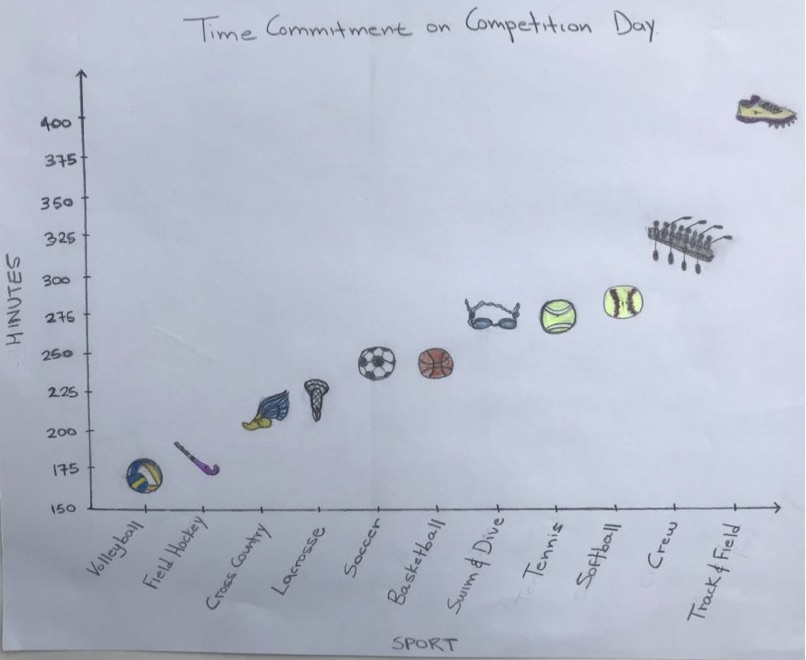

When I taught this class in Fall 2017, I left our final project assignment relatively open-ended. You can read more about the assignment on the [assignments](assignments.html) page, but essentially, groups of students created data visualization on data they found interesting. To showcase our work, we held a "poster" presentation in the atrium of Ford Hall, where students showed their work, either as paper printouts, 3D items, or digital artifacts on their laptop. A few of my favorite projects are detailed below.

Please note, I asked students if it was okay to share these projects, and got the okay from all students (including all members of group projects). I've decided to share projects without names for consistency, since several students asked to have their work shared anonymously. If you would like attribution information for graphics, please feel free to ask me. A few student authors were okay with having their names shared. 

### The Race for Congress 2018

This project used data about the generic congressional ballot vote to show party support over time. It was inspired by a piece in FiveThirtyEight, [Are Democrats/Republicans Winning The Race For Congress?](https://projects.fivethirtyeight.com/congress-generic-ballot-polls/). The FiveThirtyEight piece was national, but this student wanted to see the data broken down by region and gender. So, the student found data from RealClearPolitics and Huffington Post, and parsed and filtered it to the appropriate data. For their final project, they created a Plotly dashboard with a "memo" to the reader about the overall story. For anonymity, I've forked the project to my plotly account. See [the memo and interactive visualizations here](https://plot.ly/dashboard/AmeliaMN:24/#/). In case that link breaks, here are a few static graphics from the piece.

### Looking at Language

This project used data from the Foreign Language Enrollment Survey Report to generate hand-drawn visualizations about the foreign languages studied by K-12 students. 

 

### A brief overview of TED from 2013-2017

This project used plotly to explore TED talks over time and by event type. Before the visualization could be made in plotly, this student did data wrangling and cleaning in R using the `dplyr` package. 

Again, to preserve student privacy, I've made a copy of this plotly dashboard. You can [view the visualization here](https://plot.ly/dashboard/AmeliaMN:25/present). And again, static versions of the graphs are presented below. 

### Earthquake preparedness

This group project used data from FiveThirtyEight to study earthquake preparedness. The students created hand-drawn visualizations, and were inspired by Mona Chalabi's work where she "uses a physical representation or a drawing of the representation of the data she is showing." The students wrote, "The main point of this visualization was to show the range of earthquake counts of U.S regions in a creative way. By using the height of a skyscraper we can see the difference between the Pacific region which had an earthquake count of 1772 and the South Atlantic region which had an earthquake count of zero."

The students also created two choropleth maps, one of earthquake precuations and the other about beliefs on the "big one." 

### Mapping Portland's Public Art

This student used data from "a CSV file from CivicApps (a collaborative website from local Metro area governments and Oregon State University’s Open Source Lab), and a search engine on the Regional Art and Cultural Council website." They used R to do data wrangling, and then created an interactive map of public art in Portland. The map uses the `leaflet` library. An interactive version of this map is [hosted on this site](publicart_anon.html). Again, here are some static graphics that capture the project.

### Examining Smith College Athletics 

This group project by four Smith student-athletes examined the academic work of athletes at Smith. The students surveyed their fellow student athletes, and received 103 survey responses. They created hand-drawn visualizations to display their results. 

The first was inspired by a visualization from Dear Data, by Giorgia Lupi and Stefanie Posavec. "Each line of the flower head represents 1 hour spent on homework. Each whole flower represents a varsity team, which is measured on the x-axis. The length of the stem represents the number of athletes who responded to the survey, which is measured on the y-axis. The longer the stem, the more survey responses received from that specific team."

The students also created three additional visualizations, 

### Addictivity of drugs used by teenagers.

This group project used data about drug use in the United States by 14-year-olds. and visualized the relationship between the most commonly-used drugs, and their addictivity. The visualization was a large scale bar graph, with one bar representing the percentage of teenagers who reported using the drug, and the other the number of times a user went back to that drug. For example, 18.1\% of those surveyed said they drank in the past year, and those that drank had done so an average of 5 times over the course of a year. The visualization used 8.5x11" sheets of paper as units of measurement. For the percentage bar, each sheet represented 2\%, and for the number of uses, a sheet represented 2 uses of a drug per year. The overall visualization was large-scale and visually striking. 

